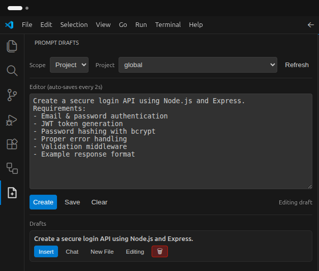

# Prompt Drafts

Save and reuse prompt drafts inside VS Code.

## Sidebar Prompt Manager

Open the **Explorer** sidebar and look for **Prompt Drafts**.

From this view you can:

- List drafts (most recently updated first)
- Insert a draft into the active editor (one click)
- Edit a draft (loads it into the editor box)
- Delete a draft

### Auto-save

- When editing an existing draft in the sidebar editor, changes auto-save every ~2 seconds.
- The **Save Prompt Draft** command input box also auto-saves what you type every ~2 seconds (so you don’t lose text if you close it).

### Project vs Global drafts

Use the **Scope** selector in the sidebar:

- **Project**: saved per-workspace (uses `workspaceState`)
- **Global**: saved across all VS Code workspaces (uses `globalState`)

## Commands

- Save Prompt Draft (`promptDrafts.save`)
- Insert Prompt Draft (`promptDrafts.insert`)

Default keybindings (customizable in VS Code):

- Save: `Ctrl+Alt+S`
- Insert: `Ctrl+Alt+I`

## Development

- Lint: `npm run lint`
- Package: `npm run package`